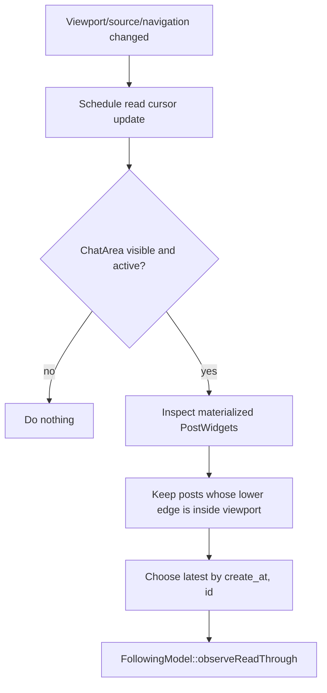
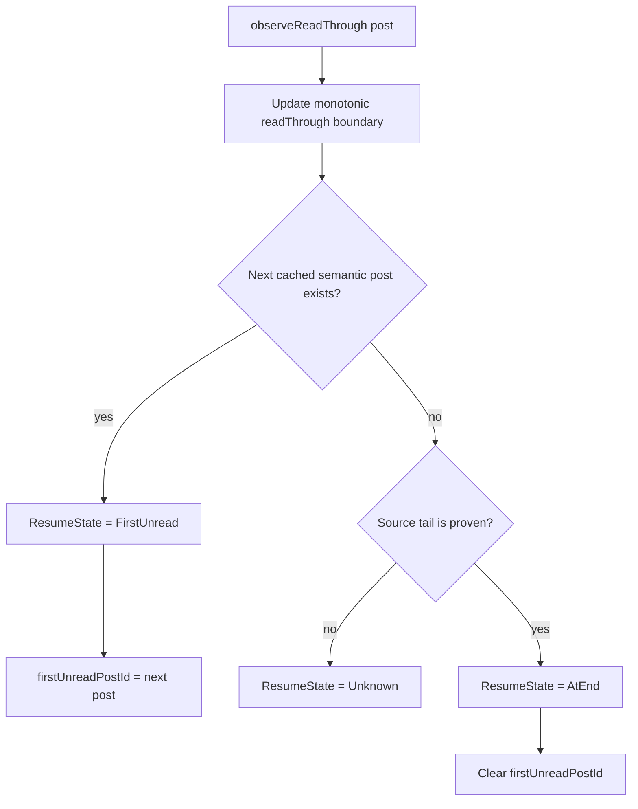
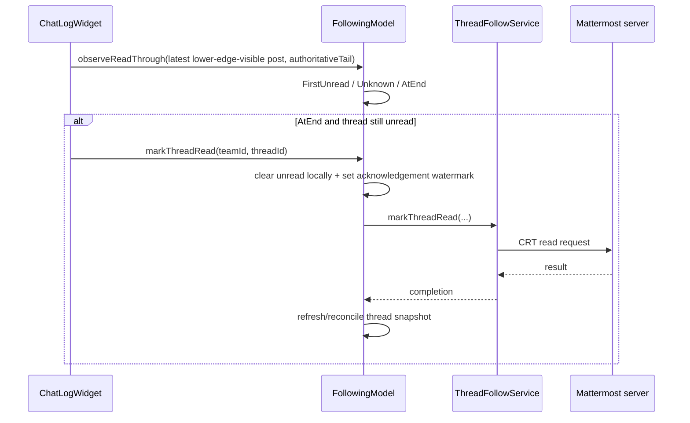
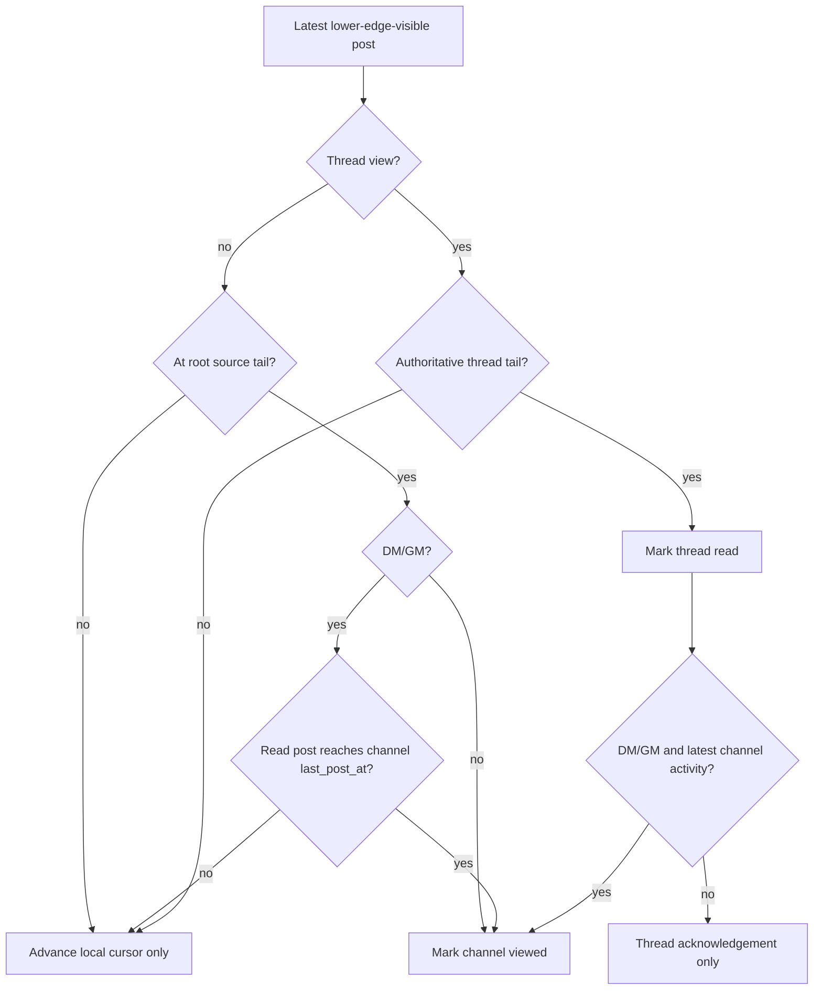

# Following, Attention and read tracking

This document is the normative contract for read progress used by the Following
and Attention sidebar views. The central rule is deliberately simple:

> A post becomes read when the lower edge of its concrete post widget enters the
> active viewport.

Navigation is not read acknowledgement. A click, successful permalink lookup,
selection change, post materialization, or navigation highlight may cause the
viewport to be re-evaluated, but none of those events by itself marks anything
read.

This rule applies to normal channel timelines and thread timelines alike.

## Components and ownership

`FollowingModel` is the single semantic model behind both sidebar projections.
`ChannelQuickList` renders the Following view and `AttentionList` renders the
subset that currently requires attention. The views own only presentation state
such as selection retention and sorting.

Read progress belongs to the timeline and shared model:

- `ChatLogWidget` observes the concrete viewport and determines the newest post
  that the user has actually read.
- `FollowingModel` owns the monotonic semantic resume cursor for entries shown in
  Following/Attention.
- `SidebarService` owns channel unread/mention state.
- `ThreadFollowService` owns the server operation that acknowledges a collapsed
  reply thread (CRT) as read.
- `ChannelQuickList` and `AttentionList` navigate to model state; they must not
  mutate read state merely because an item was clicked.

The relevant implementation files are:

- `sources/chat-area/ChatLogWidget.cpp`
- `sources/backend/FollowingModel.{h,cpp}`
- `sources/channel-tree/ChannelQuickList.cpp`
- `sources/channel-tree/AttentionList.cpp`
- `sources/chat-area/ThreadPostSource.{h,cpp}`
- `sources/backend/SidebarService.{h,cpp}`
- `sources/backend/ThreadFollowService.{h,cpp}`

For the underlying virtualized list and thread source contracts, also see
[`long-list-architecture.md`](long-list-architecture.md) and
[`thread-timeline-loading.md`](thread-timeline-loading.md).

## One read rule for every scrolling mechanism

`ChatLogWidget::updateReadCursorFromViewport()` is the canonical place where
visible timeline geometry becomes read progress. It is scheduled after viewport,
materialization, source, and navigation changes. Consequently wheel scrolling,
scrollbar dragging/clicking, keyboard scrolling, and programmatic positioning all
converge on the same geometry check.

For every materialized post widget, the lower edge is:

```text
bottom = widget.y + widget.height
```

The post qualifies as read only when:

```text
0 < bottom <= viewport.height
```

A tall message whose upper part is visible but whose lower edge is still below
the viewport is therefore **not** read. This is intentional and must not be
weakened to “the item is visible” or “the item is materialized”.

Among all posts satisfying the lower-edge condition, `ChatLogWidget` chooses the
latest semantic post by `(create_at, id)`. The logical list index is useful for
source-tail checks, but it is not the durable read identity.



## The monotonic resume cursor

An entry represented by `FollowingModel` keeps a semantic high-water mark:

```text
readThroughCreateAt
readThroughPostId
```

`FollowingModel::observeReadThrough()` never moves this boundary backwards. If
the user scrolls back to older messages, the saved read-through point remains at
the newest post previously proven read.

After advancing the boundary, the model searches the cached conversation/thread
for the first semantic post after it:



`FirstUnread` is what Following and Attention should navigate to on the next
activation. `Unknown` means the local cache has no next identity but the source
has not proved that the read post is the real tail; guessing “read” here is not
allowed. `AtEnd` means the real tail has been consumed.

## Following and Attention are projections, not read engines

Both views use the same `FollowingModel::Entry` objects and therefore the same
`ResumeState`, `firstUnreadPostId`, and read-through boundary.

Following is the broader queue. It contains followed threads and unread direct /
group conversations represented by the model. Attention filters that same model
to entries for which `requiresAttention()` is true.

The activation path may choose a destination from the cursor:

```text
FirstUnread -> navigate to firstUnreadPostId
AtEnd       -> present the conversation/thread
Unknown     -> ask the server/current model for a useful resume target
```

The activation path must not clear unread counters or synthetic mention entries.
A selected row may be retained temporarily so the item does not disappear under
the pointer while the model refreshes; retention is UI-only and must not create
an independent read state.

This is an important invariant: **Following and Attention must never differ in
what counts as read.** If clicking the same semantic entry in one projection
changes unread state while the other does not, the implementation is wrong.

## Thread end and server acknowledgement

A followed thread can only be considered fully read when the lower-edge cursor
reaches its real newest post. For `ThreadPostSource`, being at the last logical
index is not enough while navigation placement is provisional. The last post
must also have an authoritative source position:

```text
read post is source itemCount - 1
AND
ThreadPostSource::isPostPositionAuthoritative(readPost.id)
```

When that condition is true, `observeReadThrough()` reaches `AtEnd`. If the
thread still carries unread replies/mentions, `FollowingModel::markThreadRead()`
performs the Mattermost CRT acknowledgement. The model clears the local unread
state optimistically and uses `readAcknowledgementPending` /
`readAcknowledgementAt` while reconciling the following thread snapshot. A stale
snapshot that predates the acknowledgement must not resurrect unread state, but
a genuinely newer reply must.



## Channel end and server acknowledgement

Normal channel timelines use the same lower-edge cursor. When the cursor reaches
the logical tail of the root-post source, the channel is locally marked viewed
through `SidebarService` and acknowledged to the server through
`Backend::markChannelAsViewed()`.

Direct and group conversations need one extra guard. Their Following row
represents the whole conversation, including replies that may live in collapsed
threads and therefore are not part of the central root-post source. Reaching the
root-post tail must not consume a newer hidden reply. For DM/GM, conversation
acknowledgement therefore also requires that the read post reaches the channel's
latest activity (`last_post_at`). Reading the actual newest reply in its thread
advances both the thread cursor and the DM/GM conversation cursor.



## Events that trigger re-evaluation

The read cursor should be re-evaluated whenever geometry or semantic source state
can make a different lower edge visible. `ChatLogWidget` currently schedules an
update from visible-range changes, materialized-range changes, user viewport
changes, source insert/remove/range/body changes, post geometry changes, and
navigation finalization. Showing or re-presenting an already-open view may also
request one re-evaluation so a viewport that is already at the tail is not missed.

These are **triggers to inspect the viewport**, not proof of reading. The geometry
rule remains the only proof.

## Synthetic root mentions

A root post that mentions the current user can temporarily appear as a synthetic
thread-shaped Following/Attention entry before the shared thread snapshot has a
real CRT object for it. Synthetic entries obey the same rule as every other
entry: clicking one only navigates to the post. It must not be consumed on click.
Once the containing channel is genuinely acknowledged as viewed, normal model
reconciliation removes the synthetic mention.

## Invariants for future changes

Do not add a second read state machine around navigation. In particular:

- do not mark a post/channel/thread read because an item was clicked;
- do not mark it read because navigation or highlighting succeeded;
- do not treat materialization by itself as reading;
- do not use `isAtEnd()` alone as a substitute for checking the concrete newest
  post lower edge;
- do not add per-Following or per-Attention read state;
- do not add `explicitReadPending`, `threadReadPending`, or equivalent navigation
  intent flags to decide whether viewport content counts as read;
- do not let back-scrolling regress the semantic high-water mark;
- do not convert a missing cached next-post identity into `AtEnd` unless the
  source tail is proven;
- keep read identity semantic (`create_at`, `id`), not tied to a provisional
  logical index;
- put changes to the read definition in `ChatLogWidget` and changes to resume /
  shared projection state in `FollowingModel`, rather than duplicating logic in
  sidebar views.

If future behavior conflicts with this document, either the code is a regression
or this contract must be deliberately changed in the same PR.
