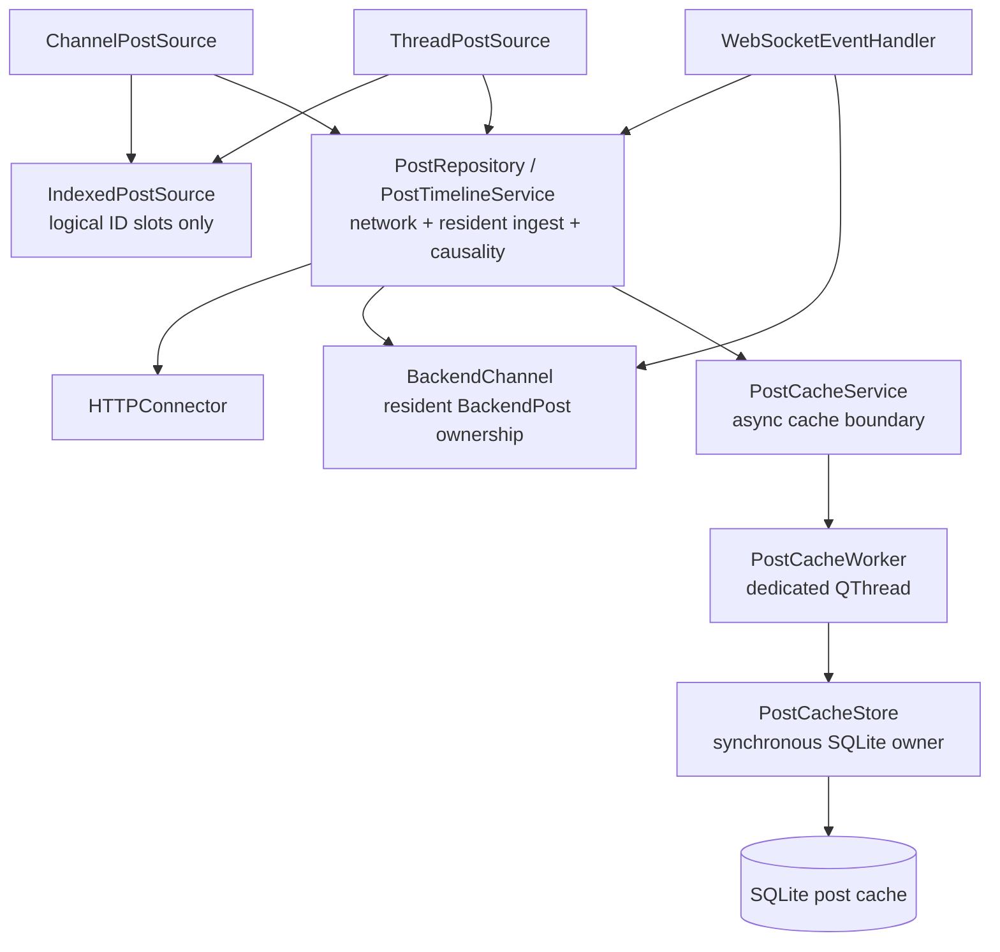
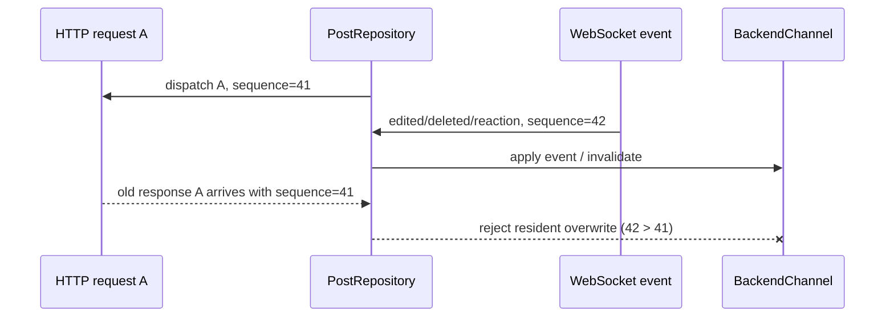
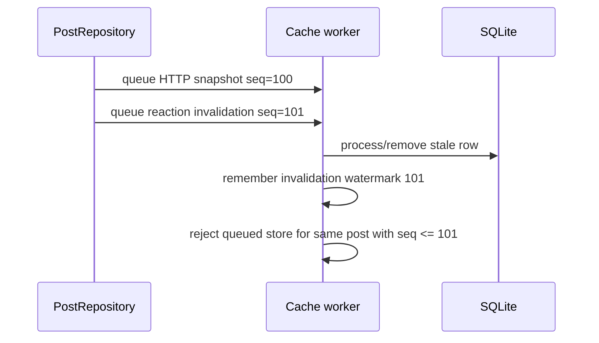
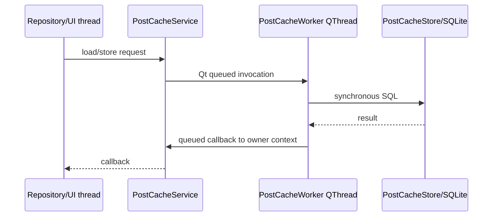
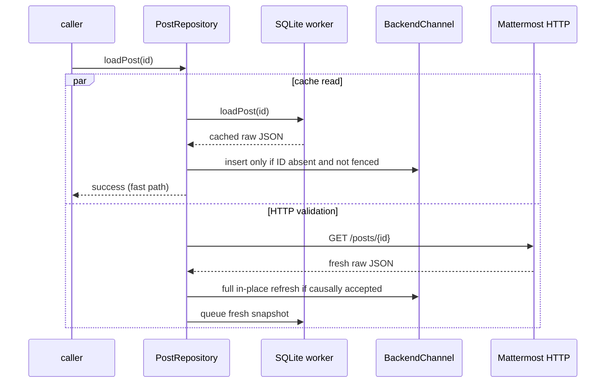

# Post cache runtime contract

This document describes the runtime behavior of the Mattermost post cache: ownership, snapshot
authority, asynchronous ordering, account isolation, read/write flows and the boundary between cached
data and logical timeline placement. `post-cache.md` contains storage policy and limits;
`post-source-architecture.md` defines source-side logical paging. This file is the detailed runtime
execution contract between those layers.

## Components and ownership



The ownership rules are strict:

- `BackendChannel` owns resident `BackendPost` objects;
- post sources own logical **post IDs and slots**, never durable raw post ownership;
- concrete post sources own logical demand planning (edge/cursor/disconnected seek and short-lived
  request attachment);
- `PostRepository` owns physical HTTP request coalescing, snapshot ingest and resident causality;
- `PostCacheService` owns asynchronous transfer to/from the cache worker;
- `PostCacheStore` owns the SQLite connection and all synchronous SQL;
- only the worker thread touches `PostCacheStore`/`QSqlDatabase`;
- `LongListWidget` and `ChatLogWidget` never access SQLite directly.

This separation allows resident eviction/rematerialization without changing source identity and keeps
viewport demand distinct from physical transport coalescing.

## Snapshot authority model

Not every observation has the same authority. There are two independent questions:

1. **payload freshness** — is this post snapshot newer than another snapshot?
2. **timeline placement** — does this observation prove a logical index/edge/cursor/page boundary?

Those must never be conflated.

| Observation | Payload authority | Timeline-placement authority |
| --- | --- | --- |
| successful current HTTP post/page/thread response | authoritative subject to causal fence | yes, only for the endpoint-specific edge/cursor/page fact it proves |
| WebSocket `posted` / `post_edited` full post object | authoritative subject to event order | live identity/content only; no arbitrary historical adjacency |
| WebSocket delete/reaction-only event | authoritative mutation/invalidation | no historical placement authority |
| resident `BackendPost` | current accepted in-process state | only the source's current ID mapping has placement authority |
| SQLite raw post snapshot | provisional/stale-capable | **never** proves channel/thread adjacency by itself |

A cache hit can therefore make a post immediately displayable without proving where arbitrary
historical neighbors belong.

## Raw snapshot representation

Persistent storage keeps compact Mattermost post JSON rather than a second normalized C++ schema.
Only fields required for lookup, ordering and eviction are duplicated into SQLite post columns:

```text
post_id
channel_id
root_id
create_at
update_at
last_access
compressed raw JSON payload
```

A separate `tail_windows` table records ordered IDs from server responses that actually proved a
newest edge. This provenance is essential: individually cached rows do not form a contiguous window.
Direct lookups, reaction invalidation and LRU eviction can all create holes. Window reads therefore
return only a newest still-complete suffix after the last missing/corrupt row.

Client-only annotations such as `_mmqt_sender_name` and `_mmqt_current_user_mentioned` are transient.
When a raw REST/cache refresh omits them, in-place refresh preserves already-known local annotation
state. Poll vote/admin metadata is also preserved when rebuilding a post-backed poll from a snapshot
that does not contain those separately fetched fields.

## Stable resident object refresh

Widgets and existing code may temporarily hold a `BackendPost*`. A fresh HTTP snapshot must therefore
not replace an already-resident object merely to refresh its contents.

```text
fresh accepted raw JSON
        |
construct temporary parsed BackendPost
        |
validate immutable identity/topology
        |  id / channel_id / root_id / create_at must match
        v
replace server-backed mutable fields in existing object
        |
preserve object address
        |
emit onPostEdited only if observable state changed
```

Fields refreshed include message/edit/delete timestamps, pin state, author, props, attachments/files,
reactions, thread metadata and poll definition.

## Observation sequence and resident causality

Arrival time is not freshness. A physical HTTP request can start before a WebSocket mutation and
finish after it:



`PostRepository` maintains a monotonic per-backend observation sequence:

- a **physical** HTTP request captures one sequence when dispatched;
- all callers coalesced onto that request share the same sequence;
- every WebSocket post mutation captures a newer sequence when observed;
- resident watermarks are stored per post ID;
- replies conservatively advance the root ID watermark too because reply ingest may modify root
  thread metadata.

Before resident ingest, each post in an HTTP response is checked against the resident watermark. A
post shadowed by a newer observation is dropped from resident ingest while unrelated posts in the same
response remain usable. Resident watermarks are short-lived in-flight causality guards, not durable
server version metadata.

## Disk write causality

The cache worker has an independent invalidation fence because durable commands execute later on a
separate thread.



Delete and reaction-only events invalidate regardless of channel admission. A cold channel is not a
reason to retain a row already known to be stale.

The resident and disk fences solve different races:

- resident fence prevents stale network work from overwriting visible in-process state;
- worker fence prevents stale queued writes from resurrecting durable rows.

Neither fence makes SQLite authoritative.

## Account isolation across asynchronous work

Every queued cache operation contains the complete account key captured when the operation is created:

```text
(normalized server URL, Mattermost user id)
```

The worker resolves/selects the integer SQLite `account_id` immediately before executing that command.
There is no mutable caller-thread "current cache account" shared by queued work. A response dispatched
for account A therefore remains in A's namespace even if account B becomes current before its callback
or worker command runs.

## Channel interest and admission

Full post payloads are expensive. Live membership/activity does not imply user interest.

Admission is normally based on **channel opened time**:

```text
opened within memory horizon (default 1 h)
    -> eligible for general resident post retention

opened within disk horizon (default 10 h)
    -> eligible for SQLite writes/retention

outside horizons
    -> metadata/unread/notification processing only
```

Opening a thread records a parent-channel open at that moment. Incoming traffic does not refresh either
horizon; otherwise a busy unread channel could keep itself hot indefinitely.

There is one precise resident exception. An open `ThreadPostSource` holds a `PostResidencyLease` on its
root. If the parent channel later becomes memory-cold, a WebSocket `posted` reply whose `root_id`
matches that leased root is still inserted into `BackendChannel` and delivered through
`channel.onNewPost`. The open thread already expresses active body interest and must receive the reply
that the server has delivered.

The exception is deliberately narrow:

- it does not make the whole parent channel memory-hot;
- unrelated roots/replies in that cold channel remain transient;
- it does not update channel-open time;
- it does not bypass the separate disk-admission horizon.

WebSocket observations still advance resident causality even when their post body is not admitted.
Durable admission is always evaluated separately.

## Asynchronous cache service

`PostCacheStore` is synchronous and thread-confined. `PostCacheService` exposes queued operations and
marshals read callbacks back to its owner thread.



On normal destruction, the service drains earlier queued writes, performs final maintenance, destroys
the SQL connection on its owning worker thread, then joins the thread. A crash may lose cache warming,
but never represents loss of unsent user/server state because the cache is disposable.

## Direct cache-first `loadPost()`

Direct lookup is conservative:

- SQLite and HTTP start independently;
- the first successful source may satisfy the caller;
- HTTP validation is always dispatched even after a cache hit;
- cached data may insert an **absent** resident identity;
- cached data never refreshes an already-resident post;
- a newer resident mutation observed after the cache read began vetoes that cached insertion;
- HTTP uses normal resident causal fencing and may refresh the cached object in place;
- failure is delivered only after both cache and HTTP have failed/missed.



The logical callback is invoked once. The later HTTP validation can still refresh resident/cache state
without becoming a second caller result.

## Why cached data cannot refresh resident data

Suppose a resident post has already received a WebSocket edit while an older SQLite read finishes
later. SQLite carries no cross-process/server revision guarantee strong enough to overwrite that state.
The rule is therefore stronger than sequence comparison:

> cache reads can fill absence, but never overwrite presence.

Only server observations (HTTP/full WebSocket snapshots) refresh resident objects.

## Newest-window hydration contract

Bounded newest-window hydration is enabled for channels with a logical count estimate and for threads.
It consumes only provenance-backed tail windows; arbitrary cached rows never become a range.

### Channel

A cached contiguous tail window may give an immediate first paint, but SQLite does not know whether
remote traffic changed the current newest edge. The source requires the cached newest root timestamp
to match current `last_root_post_at`; otherwise those snapshots remain ordinary cached bodies and are
not mapped as the current suffix. `last_post_at` is not sufficient because a thread reply advances
general channel activity without changing the root-post timeline. Older server payloads that omit
`last_root_post_at` use the existing compatibility fallback in `BackendChannel`.

A matching cached window is still only a **newest-aligned provisional suffix**:

```text
logical estimate
[ ? ? ? ? ? | cached newest IDs ]
                  provisional
```

The source immediately asks the server for authoritative newest-edge data. With current demand-aware
loading this is normally one `page=0` request sized for the needed tail window, not a mandatory series
of ten-post pages. Once exact identities exist, sequential expansion uses `before`/`after` cursors.
Server overlap upgrades/replaces the provisional suffix without moving viewport ownership out of
`LongListWidget`.

A cached suffix must never manufacture newest-edge or cursor authority merely from timestamps.

### Thread

A provenance-backed thread window contains a bounded ordered set of recent replies. The source
requires its newest cached reply timestamp to match the root's current `last_reply_at`, then publishes
those IDs provisionally into tail slots. Provisional IDs may paint, but they are not authoritative
thread cursors. A normal exact tail/initial HTTP request validates the window and upgrades/replaces its
placement.

The shared `IndexedPostSource` only mutates identities after a concrete source decides whether a
placement is exact or provisional.

### Stable identity versus resident availability

The resident cache keeps logical source IDs after their `BackendPost` body is evicted. Therefore two
state changes remain independent:

```text
identity mapping changes
    -> itemsChanged / structural slot signals

identity unchanged, resident body rematerialized
    -> availability/rematerialization notification only
```

An identical authoritative response can leave identity mapping unchanged while restoring missing
bodies. `BackendChannel::onPostBodyAvailabilityChanged` ->
`IndexedPostSource::bodyAvailabilityChanged` is the separate rematerialization path.

## Channel paging authority

`total_msg_count_root` is an initial coordinate estimate, not `/posts` visible row count. Count-excluded
system roots such as join/leave can make visible history longer than the counter; soft-deleted ordinary
roots remain represented in the historical counter while disappearing from normal visible history and
can make it shorter. Consequently ordinary scrolling should stop depending on absolute page arithmetic
as soon as exact identities are available.

Current authority order is:

```text
demand reaches known newest edge
    -> page=0 with per_page sized for contiguous demand (minimum transport chunk still allowed)

known authoritative neighbour
    -> before(postId) / after(postId)

disconnected random position
    -> absolute page/context machinery

uncertain oldest edge
    -> absolute-page probes/reconciliation
```

Absolute `/posts` pages remain the right evidence for oldest-boundary count repair and disconnected
page placement. They are no longer the only valid channel placement proof: a server `before`/`after`
response adjacent to an authoritative post identity proves its exact neighbouring logical window.

SQLite participates in none of these proofs. Cached identities may accelerate first paint or semantic
navigation, but only endpoint-specific server evidence establishes exact placement.

## Thread paging authority

Thread topology is separate from channel count repair:

```text
index 0      root
1..N         replies oldest -> newest
```

`Thread.ReplyCount` excludes deleted replies and normally gives the visible logical reply count. Thread
transport uses `(fromCreateAt, fromPost, direction)` rather than channel absolute page numbers.
Exact placement comes from the root/initial edge, tail edge, or adjacency to a known compound cursor.
Timestamp approximation is only a seed for a genuinely disconnected middle seek and must not become
an authoritative mapping without server overlap/boundary evidence.

Live replies are resident/server observations and can extend the logical tail immediately. Root summary
updates normally reserve the new reply-count slot before `onNewPost(reply)` fills it; the reply must not
be counted twice.

## Source logical attachment versus HTTP coalescing

Two different optimizations operate at different layers:

1. `PostSourceRequestGate` may attach overlapping or immediately adjacent **logical range waiters** to
   one exact in-flight edge/cursor request. The gate never expands its promised coverage and never
   creates a FIFO transport queue. Distant demand from fast scrolling can start independently.
2. `PostRepository::coalescedGet()` combines **physically identical HTTP requests**. Its observation
   sequence belongs to that one physical request and is shared by all callbacks.

These mechanisms must not be merged. The source knows logical indices, edge authority and current
demand; the repository knows URLs/physical requests and causal sequencing.

When a source request finishes, attached logical waiters are released and `LongListWidget` recomputes
what the *current* viewport still needs. It is intentionally possible for old fast-scroll demand to
become irrelevant without being executed as a queued transport chain.

## Persistent store policy

The durable cache is bounded and disposable. Current defaults:

- one SQLite database under `QStandardPaths::CacheLocation`;
- account-scoped rows;
- channels opened within 10 hours eligible for retention;
- at most 10,000 posts globally;
- at most 1,000 replies per thread;
- at most 5 GiB compressed payload budget;
- write-time limit enforcement with LRU trimming;
- periodic maintenance even without reads.

SQLite invariants:

```text
page_size = 4096
journal_mode = WAL
synchronous = NORMAL
auto_vacuum = INCREMENTAL
```

Maintenance removes expired-channel rows, reapplies limits, optimizes indexes, checkpoints/truncates
WAL and performs bounded incremental vacuum when free-page thresholds are met. Full `VACUUM` is
avoided because a multi-gigabyte cache should not require another database-sized temporary file.

## Resident-memory runtime

The resident-memory limiter uses:

- channel-open memory admission horizon: 1 hour;
- 500 MiB hard accounted limit;
- pressure trim target around 400 MiB;
- 5-minute idle TTL for unleased cold posts;
- 30-second independent sweep;
- explicit leases for visible widgets, active edit/reply contexts and active thread roots;
- source IDs surviving body eviction so they can be rematerialized from SQLite/HTTP.

`PostResidencyLease` is the move-only RAII pin for retained raw-reference/semantic-body dependencies.
Materialized `PostWidget`s, active edit/reply composer contexts and active thread roots hold leases.
Pinned-dialog copies do not accidentally pin a same-ID resident body because acquisition verifies
object ownership in `BackendChannel::postIdToPost`.

The legacy `BackendPost::rootPost` relationship is still handled conservatively: a root is not
eligible for eviction while a resident reply names that root. The durable relationship remains
`root_id`.

The 30-second sweeper removes eligible unleased bodies after idle TTL and enforces the accounted memory
limit. Accounted bytes are a stable approximation based on compact raw JSON/dynamic data, not process
RSS. Leases/dependency pins are never violated even if that temporarily leaves the cache above target.

The open-thread WebSocket exception above is an admission rule, not a replacement for leases: the root
lease proves that this particular thread remains active; newly delivered replies then participate in
normal residency/lease/TTL policy.

## Failure behavior

Cache failure must degrade to ordinary network behavior:

- SQLite open/read failure -> cache miss, continue HTTP;
- corrupt/undecodable row -> miss; authoritative HTTP may replace it;
- cache write failure -> lose warming only, never user/server state;
- stale HTTP rejected by resident fence -> other posts in the same response may remain useful;
- stale queued disk write rejected by invalidation fence -> row remains absent/newer;
- channel no longer generally resident when HTTP succeeds -> disk may still warm if captured
  account/channel admission permits it;
- no cache result may move the scrollbar or declare a server boundary by itself.

The cache is always optional correctness-wise.

## Write/invalidation matrix

| Event/source | Resident action | Disk action |
| --- | --- | --- |
| HTTP full post/page/thread snapshot | causally accepted full in-place ingest | queue upsert if disk-eligible |
| WebSocket `posted` full snapshot | add/update if channel memory-eligible **or reply targets a leased open-thread root**; otherwise transient; always advance fence | queue upsert only if disk-eligible |
| WebSocket `post_edited` full snapshot | in-place refresh if resident; advance fence | queue upsert if disk-eligible |
| WebSocket delete | tombstone/remove according to UI semantics; advance fence | unconditional remove/invalidate |
| WebSocket reaction add/remove | mutate resident reaction if resident; advance fence | unconditional invalidate because event is not a full snapshot |
| SQLite direct read | insert only if absent and unfenced | none |

## What the cache never owns

The cache layer must not:

- calculate scrollbar pixels;
- decide viewport anchoring;
- create logical gap widgets;
- choose channel page/cursor authority from cached timestamps;
- choose thread adjacency solely from cached timestamps;
- refresh a newer resident object from SQLite;
- treat message traffic as channel-interest renewal;
- turn the open-thread reply exception into whole-channel admission;
- mix queued operations across accounts;
- block UI/network callbacks on SQL commits.

## Implementation status

Implemented in the current architecture:

- account-scoped `PostCacheStore` schema and compressed raw JSON;
- write-time limits, LRU, WAL maintenance and incremental vacuum;
- dedicated asynchronous `PostCacheService` worker thread;
- account identity captured per queued operation;
- HTTP write-through for post-bearing responses;
- WebSocket new/edit write-through plus delete/reaction invalidation;
- disk invalidation watermarks;
- full stable-address `BackendPost` refresh;
- resident observation fencing against stale HTTP;
- direct cache-first `loadPost()` with mandatory HTTP validation;
- provenance-backed newest channel/thread window hydration as provisional first paint;
- resident leases and bounded resident-memory policy;
- precise resident admission of live replies whose root is leased by an open thread;
- source-side demand planning/attachment separated from repository physical request coalescing.

Further work should preserve those contracts rather than reintroduce fixed-block view paging or
whole-channel admission as shortcuts.

## Required tests for future changes

Any cache/source change that affects read authority or causality should cover at least these races:

1. cache hit arrives before HTTP and caller completes once;
2. HTTP wins before cache read; late cache cannot overwrite resident data;
3. WebSocket edit/delete arrives after HTTP dispatch but before HTTP response; stale HTTP is rejected;
4. queued stale disk write follows a newer invalidation; row is not resurrected;
5. account switches while old operations remain queued; rows stay in original account namespace;
6. cached newest suffix paints without claiming server edge/cursor authority;
7. authoritative page/cursor overlap replaces provisional identities without duplicate IDs;
8. repeated identical authoritative window is a source no-op and cannot trigger a request loop;
9. reply to a leased open-thread root remains resident/delivered after the parent channel becomes
   memory-cold while unrelated cold-channel posts stay transient;
10. source request attachment accepts overlap/immediate adjacency, does not expand expected coverage,
    and allows distant fast-scroll demand to proceed independently.
