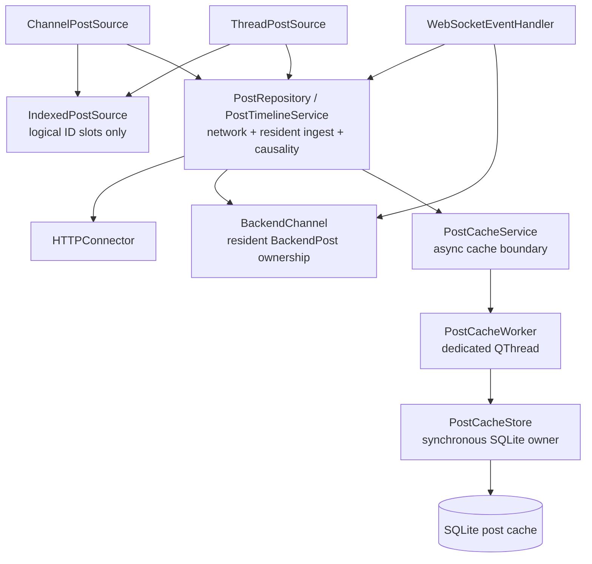
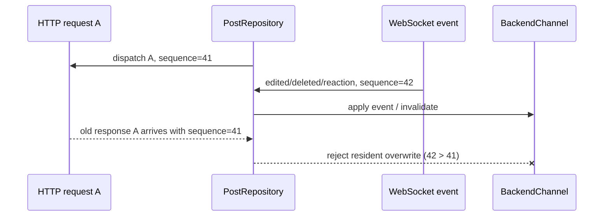
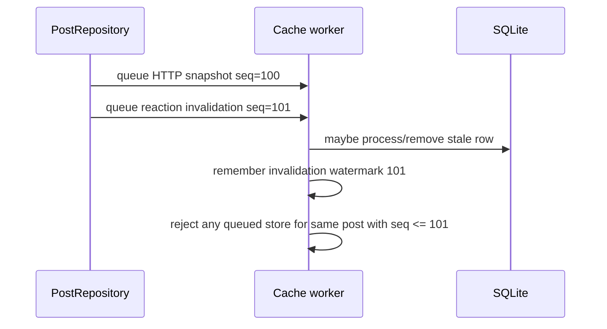
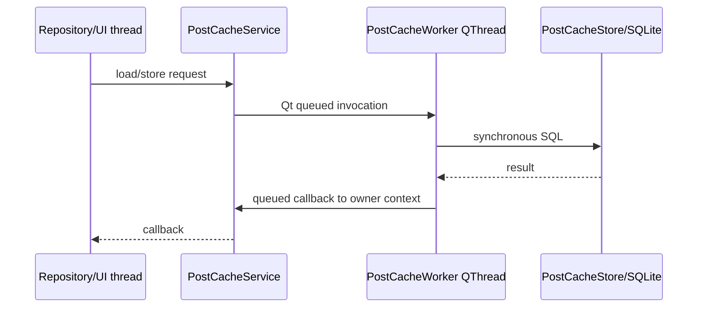
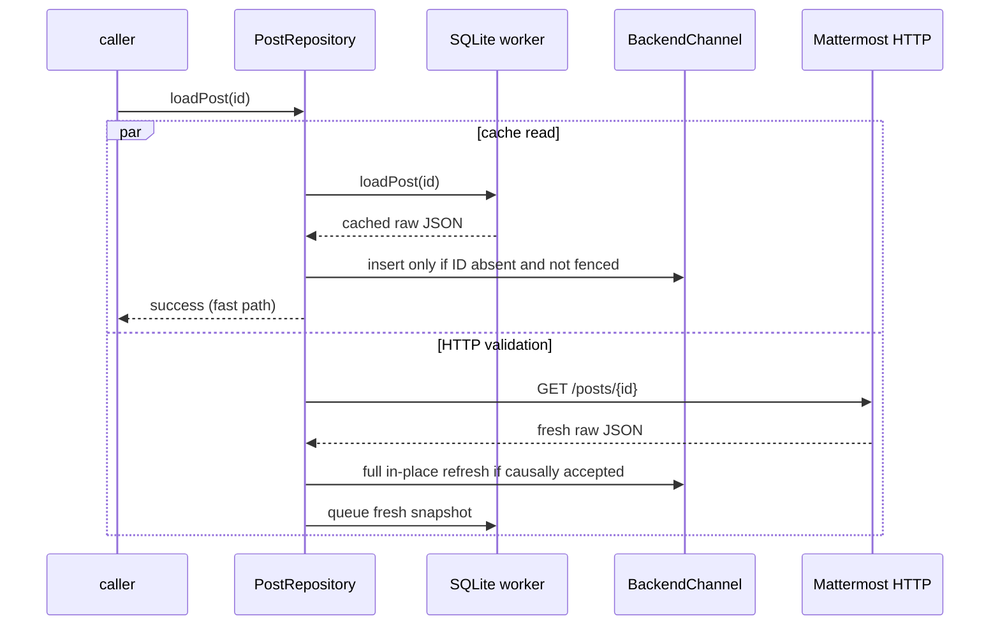

# Post cache runtime contract

This document describes the runtime behavior of the Mattermost post cache: ownership, snapshot
authority, asynchronous ordering, account isolation, read/write flows and the boundary between cached
data and logical timeline placement. `post-cache.md` contains the storage policy, limits and rollout
phases; this file is the detailed execution contract.

## Components and ownership



The ownership rules are strict:

- `BackendChannel` owns resident `BackendPost` objects.
- post sources own logical **post IDs and slots**, never durable raw post ownership;
- `PostRepository` owns HTTP request coalescing, snapshot ingest and resident causality;
- `PostCacheService` owns asynchronous transfer to/from the cache worker;
- `PostCacheStore` owns the SQLite connection and all synchronous SQL;
- only the worker thread touches `PostCacheStore`/`QSqlDatabase`;
- `LongListWidget` and `ChatLogWidget` never access SQLite directly.

This separation is required so resident eviction can later remove a `BackendPost` without changing its
logical source identity.

## Snapshot authority model

Not every observation has the same authority. There are two independent questions:

1. **payload freshness** — is this post snapshot newer than another snapshot?
2. **timeline placement** — does this observation prove a logical index/page/cursor boundary?

Those must never be conflated.

| Observation | Payload authority | Timeline-placement authority |
| --- | --- | --- |
| successful current HTTP post/page/thread response | authoritative subject to causal fence | yes, only for the endpoint-specific boundary it proves |
| WebSocket `posted` / `post_edited` full post object | authoritative subject to event order | live identity/content only; no arbitrary historical page authority |
| WebSocket delete/reaction-only event | authoritative mutation/invalidation | no historical placement authority |
| resident `BackendPost` | current accepted in-process state | only the source's current ID mapping has placement authority |
| SQLite raw post snapshot | provisional/stale-capable | **never** proves absolute channel page or thread cursor adjacency |

A cache hit can therefore make a post immediately displayable without proving where arbitrary
historical neighbors belong.

## Raw snapshot representation

Persistent storage keeps compact Mattermost post JSON rather than a second normalized C++ schema.
Only fields required for lookup, ordering and eviction are duplicated into SQLite post columns:

```text
post_id
channel_id
root_id
create_at
update_at
last_access
compressed raw JSON payload
```

A separate `tail_windows` table records the ordered IDs of server responses that actually proved a
newest edge. This provenance is essential: a set of individually cached rows is not a contiguous
window. Direct post lookups, reaction invalidation and LRU eviction can all create holes. Window reads
therefore ignore arbitrary row bags and return only the newest still-complete suffix after the last
missing/corrupt row.

Benefits:

- future post fields survive cache round-trips without schema migrations;
- one parser (`BackendPost`) remains responsible for Mattermost post semantics;
- disk schema stays small and stable;
- HTTP and WebSocket full snapshots can use the same write path.

Client-only annotations such as `_mmqt_sender_name` and `_mmqt_current_user_mentioned` are transient.
When a raw REST/cache refresh omits them, in-place refresh preserves already-known local annotation
state rather than clearing it.

Poll vote/admin metadata is fetched through a separate endpoint. Rebuilding the post-backed poll
object preserves that separately acquired metadata when both old and new snapshots contain a poll.

## Stable resident object refresh

Widgets and existing code may temporarily hold a `BackendPost*`. A fresh HTTP snapshot must therefore
not replace an already-resident object with a new allocation merely to refresh its contents.

The refresh contract is:

```text
fresh accepted raw JSON
        |
construct temporary parsed BackendPost
        |
validate immutable identity/topology
        |  id / channel_id / root_id / create_at must match
        v
replace all server-backed mutable fields in existing object
        |
preserve object address
        |
emit onPostEdited only if observable state changed
```

Fields refreshed include message/edit/delete timestamps, pin state, author, props, attachments/files,
reactions, thread metadata and poll definition. This full in-place refresh is a prerequisite for
cache-first reads: a provisional cached object can later be upgraded by HTTP without invalidating a
widget pointer.

## Observation sequence and resident causality

Arrival time is not freshness. A physical HTTP request can start before a WebSocket mutation and
finish after it:



`PostRepository` maintains a monotonic per-backend observation sequence:

- a **physical** HTTP request captures one sequence when dispatched;
- all callers coalesced onto that request share the same sequence;
- every WebSocket post mutation captures a newer sequence when observed;
- resident watermarks are stored per post ID;
- replies conservatively advance the root ID watermark too because reply ingest may modify root
  thread metadata.

Before resident ingest, each post in an HTTP response is checked against the resident watermark. If a
newer observation exists, that individual stale post is dropped from resident ingest. Other posts in
the same response remain usable.

Resident watermarks are not durable version metadata. They exist only to fence realistically
in-flight work and are pruned after a generous lifetime once the map grows beyond its threshold.

## Disk write causality

The cache worker has an independent invalidation fence because durable commands execute later on a
separate thread.

Example:



Delete and reaction-only events invalidate regardless of channel admission. A cold channel is not a
reason to retain a row already known to be stale.

The resident and disk fences solve related but different races:

- resident fence prevents stale network work from overwriting the visible in-process model;
- worker fence prevents stale queued writes from resurrecting durable rows.

Neither fence makes SQLite authoritative.

## Account isolation across asynchronous work

Every queued cache operation contains the complete account key captured at the time the operation is
created:

```text
(normalized server URL, Mattermost user id)
```

The worker resolves/selects the integer SQLite `account_id` immediately before executing that command.
There is no caller-thread mutable "current cache account" shared by queued work.

Therefore this race is safe:

```text
account A dispatches HTTP/cache operation
user logs out
account B logs in
old A response finishes
cache worker executes delayed command
```

The operation still addresses A's account namespace. It cannot be filed under B merely because B is
current when the callback runs.

## Channel interest and admission

Full post payloads are expensive. Live membership/activity does not imply user interest.

Admission is based on **channel opened time**:

```text
opened within memory horizon (default 1 h)
    -> eligible for resident post retention

opened within disk horizon (default 10 h)
    -> eligible for SQLite writes/retention

outside horizons
    -> metadata/unread/notification processing only
```

Opening a thread counts as opening its parent channel. Incoming traffic does not refresh these
horizons. This prevents a busy but unread channel from pinning itself indefinitely in RAM or disk.

WebSocket `posted`/`post_edited` still advances resident causality even when the channel is not disk
eligible. Durable admission is evaluated separately.

## Asynchronous cache service

`PostCacheStore` is synchronous and thread-confined. `PostCacheService` exposes queued operations and
marshals read callbacks back to its owner thread.



On normal destruction, the service performs a blocking worker-thread shutdown only from outside the
worker thread. All earlier queued writes drain, final maintenance runs, the SQL connection is destroyed
on its owning thread, then the thread is joined.

A crash may lose not-yet-committed cache warming. This is acceptable because the cache is disposable
and never represents unsent user state.

## Direct cache-first `loadPost()`

Direct lookup is the first enabled read-side path.

The rules are intentionally conservative:

- SQLite and HTTP start independently;
- the first successful source may satisfy the caller;
- HTTP validation is always dispatched even after a cache hit;
- cached data may insert an **absent** resident identity;
- cached data never refreshes an already-resident post;
- a newer resident mutation observed after the cache read began vetoes that cached insertion;
- HTTP uses normal resident causal fencing and may refresh the cached object in place;
- failure is delivered only after both cache and HTTP have failed/missed.



The callback is not invoked twice. A cache hit can complete the caller early; the later HTTP response
still performs validation/cache warming but is not a second logical result callback.

## Why cached data cannot refresh resident data

Suppose a resident post has already received a WebSocket edit, while an older SQLite read finishes
later. SQLite carries no cross-process or server revision guarantee strong enough to overwrite that
resident state safely. The rule is therefore stronger than sequence comparison:

> cache reads can fill absence, but never overwrite presence.

Only server observations (HTTP/full WebSocket snapshots) refresh resident objects.

## Newest-window hydration contract

Bounded newest-window hydration is enabled for channels with a logical count estimate and for threads.
It consumes only provenance-backed tail windows; arbitrary cached rows never become a range.

### Channel

A cached contiguous tail window may give an immediate first paint, but SQLite does not know the
current absolute `/posts?page=N&per_page=10` grid after remote traffic changed the channel. The source
also requires the cached newest root timestamp to match current channel `last_root_post_at`; otherwise
the window is retained only as ordinary cached bodies and is not mapped as the current suffix. This
must not use `last_post_at`, because a thread reply advances general channel activity without changing
the root-post timeline. Older server payloads that omit `last_root_post_at` fall back to
`last_post_at` in `BackendChannel`. Live `posted` events advance both resident channel markers before
post-body memory admission is evaluated, so even a cold channel cannot later accept a suffix older
than an already observed WebSocket root post.

Therefore a cached channel window is a **newest-aligned provisional suffix** only:

```text
logical estimate
[ ? ? ? ? ? | cached newest IDs ]
                  provisional
```

The source immediately requests the normal authoritative ten-post channel pages. When those pages
arrive, identity overlap adopts/replaces the provisional suffix without moving viewport ownership out
of `LongListWidget`.

A cached suffix must never manufacture `page=0` authority merely from timestamps.

### Thread

A provenance-backed thread window contains a bounded ordered set of recent replies. The source
requires its newest cached reply timestamp to match the root's current `last_reply_at`, then publishes
those IDs provisionally into tail slots. Provisional IDs are displayable but are deliberately treated
as missing for request planning and may not serve as thread cursors. A normal initial/tail HTTP request
is dispatched immediately and upgrades/replaces the mapping with endpoint-authoritative adjacency.

The shared `IndexedPostSource` only performs identity-slot mutation after a concrete source decides
whether placement is exact or provisional. See `post-source-architecture.md`.

### Stable identity versus resident availability

The resident cache keeps logical source IDs after their `BackendPost` body is evicted. Therefore two
state changes remain independent:

```text
identity mapping changes
    -> itemsChanged / structural slot signals

identity unchanged, resident body rematerialized
    -> availability/rematerialization notification only
```

An identical authoritative page can leave identity mapping unchanged while restoring missing bodies.
`BackendChannel::onPostBodyAvailabilityChanged` -> `IndexedPostSource::bodyAvailabilityChanged` is the
separate rematerialization path: `LongListWidget` clears/materializes body availability without
pretending that the source identity mapping changed. This preserves both request-loop protection and
safe body eviction.

## Channel paging authority

Ordinary channel history keeps one invariant transport page size:

```text
per_page = 10
```

`total_msg_count_root` is not `/posts` row count. Deleted roots can make it too large; system roots
excluded from message-count semantics can make it too small. The channel source repairs this estimate
symmetrically using `/posts` boundary evidence.

SQLite does not participate in this proof. Cached identities may speed presentation or semantic
navigation, but only absolute HTTP page results establish the physical channel page mapping.

## Thread paging authority

Thread count/topology is separate from channel page repair:

```text
index 0      root
1..N         replies
```

Thread transport uses `(fromCreateAt, fromPost, direction)` rather than absolute page numbers. Exact
placement comes from the initial edge, tail edge or adjacency to a known cursor identity. Cached reply
timestamps are not enough to invent adjacency.

Live replies are resident/server observations and can extend the logical tail immediately. The current
`BackendChannel` event ordering reserves the new reply-count slot through `onPostEdited(root)` before
`onNewPost(reply)` fills it; the reply must not be counted a second time.

## Persistent store policy

The durable cache is bounded and disposable. Current defaults:

- one SQLite database under `QStandardPaths::CacheLocation`;
- account-scoped rows;
- channels opened within 10 hours eligible for retention;
- at most 10,000 posts globally;
- at most 1,000 replies per thread;
- at most 5 GiB compressed payload budget;
- write-time limit enforcement with LRU trimming;
- periodic maintenance even without reads.

SQLite invariants:

```text
page_size = 4096
journal_mode = WAL
synchronous = NORMAL
auto_vacuum = INCREMENTAL
```

Maintenance removes expired-channel rows, reapplies limits, optimizes indexes, checkpoints/truncates
WAL and performs bounded incremental vacuum when free-page thresholds are met. Full `VACUUM` is
avoided because a multi-gigabyte cache should not require another database-sized temporary file.

## Resident-memory target architecture

The resident-memory limiter is enabled with the following contract:

- channel-open memory admission horizon: 1 hour;
- 500 MiB hard accounted limit;
- pressure trim target around 400 MiB;
- 5-minute idle TTL for unleased cold posts;
- 30-second independent sweep;
- explicit leases for visible widgets, active edit/reply contexts and active thread roots;
- sources retain post IDs, not permanent raw pointers;
- evicted IDs can be rematerialized from SQLite/HTTP.

`PostResidencyLease` implements the raw-reference lifetime contract as a move-only RAII pin in `PostRepository`. Every materialized `PostWidget` owns one for its full lifetime. The outgoing composer owns an independent edit-session lease because `postToEdit` may outlive the materialized row while an edit request is pending or retryable. Actual eviction may only consider posts with zero explicit leases. A root also remains implicitly non-evictable while a resident reply still points to it through the legacy `BackendPost::rootPost` relationship.

`PostResidencyLease` is the move-only RAII pin for retained raw-reference/semantic-body dependencies.
Materialized `PostWidget`s, active edit/reply composer contexts and active thread roots hold leases.
Pinned-dialog copies do not accidentally pin a same-ID resident body because lease acquisition verifies
object ownership in `BackendChannel::postIdToPost`. The legacy `BackendPost::rootPost` relationship is
still handled conservatively: a root is not evictable while any resident reply names that root. The
durable relationship remains `root_id`, and removing the raw root pointer is still a later cleanup.

The 30-second sweeper removes unleased bodies after the 5-minute idle TTL. It also enforces a 500 MiB
accounted hard limit with a 400 MiB pressure target. Accounted bytes use a stable approximation derived
from compact raw JSON (or a structural fallback for legacy residents); this is intentionally cache
accounting, not process RSS. Crossing the hard limit schedules an immediate sweep, and leases/dependency
pins are never violated even when that means temporarily remaining above the configured cap.

Memory accounting is cache-accounted retained memory, not process RSS. Qt/container/allocator RSS is
not portable enough to enforce a deterministic cache policy.

## Failure behavior

Cache failure must degrade to ordinary network behavior.

- SQLite open/read failure -> treat as cache miss and continue HTTP;
- corrupt/undecodable row -> miss; authoritative HTTP may replace it;
- cache write failure -> lose warming only, never user/server state;
- stale HTTP rejected by resident fence -> may still be useful for unrelated posts in same response;
- stale queued disk write rejected by invalidation fence -> row remains absent/newer;
- channel no longer resident when HTTP succeeds -> cache may still warm if the request's captured
  account/channel admission permits it;
- no cache result may move the scrollbar or declare a server boundary by itself.

The cache is always optional correctness-wise.

## Request coalescing interaction

`PostRepository::coalescedGet()` coalesces identical physical HTTP requests. The observation sequence
belongs to the physical request, not to each logical waiter. This prevents a later waiter from
artificially making old network work appear fresh.

Window hydration must preserve this behavior: if cached first paint schedules the same authoritative
page that `LongListWidget` independently requests, the repository should produce one physical HTTP
transaction with multiple logical callbacks.

## Write/invalidation matrix

| Event/source | Resident action | Disk action |
| --- | --- | --- |
| HTTP full post/page/thread snapshot | causally accepted full in-place ingest | queue upsert if disk-eligible |
| WebSocket `posted` full snapshot | add/update resident if memory-eligible/open; always advance fence | queue upsert if disk-eligible |
| WebSocket `post_edited` full snapshot | in-place refresh if resident; advance fence | queue upsert if disk-eligible |
| WebSocket delete | tombstone/remove according to UI semantics; advance fence | unconditional remove/invalidate |
| WebSocket reaction add/remove | mutate resident reaction if resident; advance fence | unconditional invalidate because event is not a full snapshot |
| SQLite direct read | insert only if absent and unfenced | none |

## What the cache never owns

The cache layer must not:

- calculate scrollbar pixels;
- decide viewport anchoring;
- create logical gap widgets;
- choose channel page numbers from cached timestamps;
- choose thread adjacency solely from cached timestamps;
- refresh a newer resident object from SQLite;
- treat message traffic as channel-interest renewal;
- mix queued operations across accounts;
- block UI/network callbacks on SQL commits.

## Implementation status

Implemented:

- account-scoped `PostCacheStore` schema and compressed raw JSON;
- write-time limits, LRU, WAL maintenance and incremental vacuum;
- dedicated asynchronous `PostCacheService` worker thread;
- account identity captured per queued operation;
- HTTP write-through for post-bearing responses;
- WebSocket new/edit write-through;
- delete/reaction invalidation;
- disk invalidation watermarks;
- full stable-address `BackendPost` refresh;
- resident observation fencing against stale HTTP;
- asynchronous cache reads;
- direct cache-first `loadPost()` with mandatory HTTP validation;
- asynchronous cache-service tests.

Next read-side work:

- channel newest-suffix hydration as provisional identities;
- thread root/newest-reply hydration with thread-specific provenance;
- background authoritative validation using existing request coalescing.

Later resident-memory work:

- explicit residency leases;
- retained-memory accounting;
- timed sweeper/TTL;
- safe `BackendPost` eviction and rematerialization.

## Required tests for future changes

Any cache change that affects read authority or causality should cover at least these races:

1. cache hit arrives before HTTP and caller completes once;
2. HTTP wins before cache read; late cache cannot overwrite resident data;
3. WebSocket edit/delete arrives after HTTP dispatch but before HTTP response; stale HTTP is rejected;
4. queued stale disk write follows a newer invalidation; row is not resurrected;
5. account switches while old operations remain queued; rows stay in original account namespace;
6. cached newest suffix paints without claiming absolute channel-page authority;
7. authoritative page/cursor overlap replaces provisional identities without duplicate IDs;
8. repeated identical authoritative window is a source no-op and cannot trigger a request loop.
