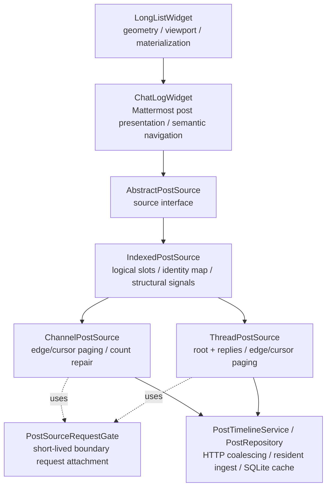
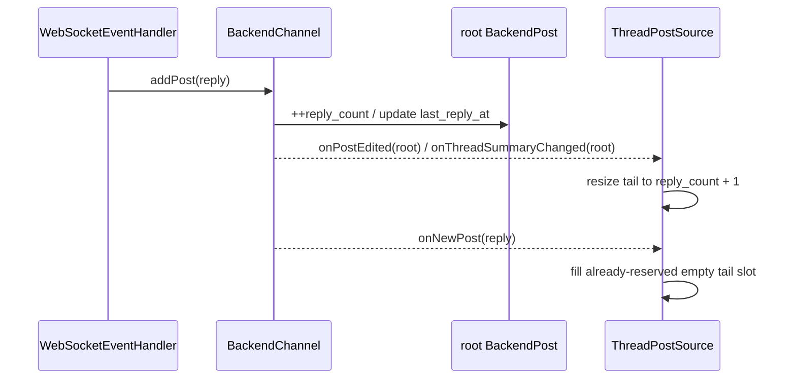

# Post source architecture

This document defines the ownership boundary shared by channel and thread timelines. It complements
`long-list-architecture.md` (viewport/geometry ownership) and `post-cache.md` (resident/durable post
storage). The central rule is that a source owns **logical post identity and transport planning**, never
pixels.

## Layering



`ChatLogWidget` intentionally does not own `postIds`, page arithmetic or thread cursor state. Both
concrete sources expose the same logical contract through `AbstractPostSource`; common identity
bookkeeping lives in `IndexedPostSource`.

`PostSourceRequestGate` is deliberately a small helper rather than another source base class. Channel
and thread sources share the mechanics of attaching adjacent logical demand to one exact in-flight
boundary request, but they do **not** share enough count/boundary semantics to justify hiding their
transport policy behind inheritance.

## `AbstractPostSource`: interface only

`AbstractPostSource` is deliberately small. It defines what the view can ask of a logical sequence:

```cpp
itemCount();
isAvailable(index);
postAt(index);
indexOfPost(postId);
ensurePostIndex(postId);
requestRange(first, last, reason, generation);
```

and the structural/data signals consumed by `ChatLogWidget`:

```text
itemCountChanged(count)
itemsInserted(first, count)
itemsRemoved(first, count)
rangeAvailable(first, last)
itemsChanged(first, last)
rangeRequestFinished(first, last)
```

It contains no Mattermost paging policy and no storage container. This keeps alternate future post
sources possible without inheriting channel/thread assumptions.

`rangeRequested(first,last,...)` is **logical demand**, not an instruction to perform one HTTP request
per fixed-size block. For ordinary viewport/prefetch work `LongListWidget` may request one contiguous
missing range spanning the whole desired window. The concrete source decides whether that demand is
best satisfied by an edge bootstrap, an exact cursor walk, an in-flight attachment, or a disconnected
seek.

## `IndexedPostSource`: shared logical identity space

Both current Mattermost sources maintain the same fundamental structures:

```cpp
QVector<QString> postIds;        // logical index -> post id; empty means unavailable
QHash<QString, int> postIndexes; // post id -> current logical index
BackendChannel& channel;         // resident identity -> BackendPost resolution
```

`IndexedPostSource` owns these structures and implements:

- `itemCount()`;
- `isAvailable()`;
- `postAt()`;
- `indexOfPost()`;
- rebuilding the reverse identity map;
- exact-window identity assignment;
- duplicate relocation when an authoritative window moves a previously provisional identity;
- no-op suppression when an already-known window is fetched again;
- tail resize;
- insertion of empty logical slots;
- structural slot removal.

It still does **not** know why a window is exact, which side of a sequence is authoritative, or which
network request produced it.

### Exact-window mutation

Concrete sources first establish positional authority, then hand the identity mutation to the base:

```text
source proves: IDs A B C belong at logical [17..19]
        |
        v
assignExactWindow(17, [A,B,C])
        |
        +-- clear old occurrences of A/B/C elsewhere
        +-- write A/B/C into [17..19]
        +-- rebuild postIndexes
        +-- report concrete identities that were replaced/cleared
        |
        v
publishExactWindow(...)
        |
        +-- itemsChanged only for previously concrete rows that changed
        +-- rangeAvailable for newly authoritative/available window
```

Fetching an identical page twice currently produces no source signals. This matters because
`rangeAvailable` and `itemsChanged` both schedule list synchronization; emitting them for an identity
no-op can turn a boundary mismatch into a tight repeat-request loop.

This identity no-op rule must remain separate from future resident-body availability. Once Phase 3 can
evict a `BackendPost` while retaining its source ID, rematerializing that same ID must publish
"resident body available again" even though the logical identity mapping did not change. That path
should be an explicit availability/rematerialization notification, not a fake identity mutation.

An empty string remains an **unavailable logical slot**, not a fake post and not a widget placeholder.
Only `LongListWidget` owns its estimated pixel height.

### Structural mutation

There are three generic structural primitives:

```text
resizeLogicalTail(newCount)
    changes only the newest/tail side and emits itemCountChanged

insertEmptyLogicalSlots(first, count)
    shifts existing logical identities right and emits itemsInserted

eraseLogicalSlots(first, count)
    removes logical identities, shifts later identities left and emits itemsRemoved
```

The base does not choose which primitive a count correction requires. That is topology-specific.

## Shared boundary-request attachment

Ordinary scrolling can produce another range demand while an exact edge/cursor request is still in
flight. Starting an equivalent HTTP request wastes bandwidth, but queuing arbitrary later demands
behind the first request is also wrong when the user scrolls quickly.

`PostSourceRequestGate` therefore tracks only the logical range an exact physical request is expected
to cover plus the logical request waiters attached to it:

```text
in-flight expected range: 130..149
new demand 120..129        -> attach (adjacent)
new demand 135..145        -> attach (overlap)
new demand 100..119        -> do not attach; may start independently
```

Attaching a waiter does **not** expand the expected range. When the HTTP request completes, the source
finishes all attached logical requests and lets `LongListWidget` recompute demand from the current
viewport. There is no source-side FIFO chain that blindly continues loading stale ranges after the user
has moved elsewhere.

Seek requests are not attached to ordinary boundary work: a new random seek has its own generation and
must be free to supersede old viewport intent.

This source-level gate is distinct from `PostRepository` request coalescing. The gate reasons about
logical coverage and current viewport demand; repository coalescing only deduplicates physically
equivalent HTTP requests.

## Channel source

`ChannelPostSource` maps ordinary channel roots onto oldest-to-newest logical indices. Mattermost
`/channels/{id}/posts` still provides newest-anchored absolute pages, but absolute page arithmetic is
no longer the primary path for ordinary scrolling.

The normal loading order is:

```text
known newest edge + demand touches tail
        -> page=0, per_page sized for the contiguous demand (with a small minimum)

known authoritative neighbour
        -> before(postId) / after(postId)

disconnected random window
        -> absolute page / navigation-context machinery

oldest edge with uncertain total count
        -> absolute-page boundary repair
```

Once an authoritative identity is available next to a gap, its `before`/`after` cursor is stronger
than a page number derived from the approximate channel row count. Sequential wheel scrolling should
therefore remain on exact identities even when `total_msg_count_root` differs from the number of rows
returned by `/posts`.

Transport-specific responsibilities that stay in `ChannelPostSource` include:

- using page zero as the exact newest-edge bootstrap;
- exact placement immediately before/after known root-post identities;
- converting disconnected/random logical positions to absolute Mattermost pages when no cursor is
  available;
- interpreting `total_msg_count_root` only as an initial estimate;
- symmetric oldest-boundary repair when that estimate is too large or too small;
- one-root distant boundary probes, exponential search and bounded binary search;
- preserving newest-page mapping while count growth/shrink changes the oldest prefix;
- provisional semantic navigation windows and adoption when authoritative context later intersects
  them;
- unknown-count compatibility mode when `total_msg_count_root` is absent.

### Channel count topology

A channel count correction preserves the **newest edge**:

```text
estimate too small                     estimate too large

[ newest known rows ]                   [ phantom ][ real rows ]
        ^                                         |
        | add empty prefix                         | remove prefix
        |                                         v
[ ? ? ? | newest known rows ]            [ real rows ]
```

This is why channel count repair uses prefix insertion/removal rather than the generic tail resize.
The proof of the corrected count remains channel-specific: only server boundary evidence from `/posts`
has that authority.

`total_msg_count_root` is not the visible `/posts` row count. Count-excluded system roots such as
join/leave events can make visible history longer than the counter, while soft-deleted ordinary roots
remain represented in the historical counter but are not returned as normal visible rows and can make
visible history shorter. The source therefore treats the value as coordinate-estimation input, never
as proof of the oldest boundary.

## Thread source

`ThreadPostSource` maps one root plus replies:

```text
index 0             root
indices 1..N        replies oldest -> newest
```

Mattermost threads do not share the channel absolute-page grid. They are loaded through root/thread
requests and `(fromCreateAt, fromPost, direction)` cursors.

The normal loading order is symmetrical at the two known thread edges:

```text
demand begins at root
        -> one oldest/initial request sized for the demand

demand touches newest reply edge
        -> one tail request sized for the demand

known authoritative neighbour
        -> before/after compound cursor

genuinely disconnected middle seek
        -> timestamp seed, then exact cursors after overlap
```

Transport/topology responsibilities that stay in `ThreadPostSource` include:

- root permanently occupying logical index 0;
- `reply_count + 1` as the initial logical size estimate;
- initial oldest window and newest tail placement;
- exact placement immediately before/after a known compound cursor identity;
- timestamp approximation only for a genuinely disconnected middle seek;
- root/reply filtering;
- live reply ordering and count interaction;
- any future thread count reconciliation based on thread-specific boundary evidence.

Mattermost `ReplyCount` excludes deleted replies, so unlike channel `total_msg_count_root` it normally
tracks the server-visible reply sequence. A locally retained tombstone must not silently turn into a
second independent definition of thread length.

### Live reply transaction

A posted reply currently enters the resident model in this order:



An open `ThreadPostSource` leases its root. WebSocket admission uses that root lease as a precise signal
that a reply body must remain resident even when the parent channel itself is otherwise cold. This
ensures `channel.onNewPost` reaches the open thread without making every post in that channel resident.

The reply must be counted exactly once. A root summary update normally reserves the new logical tail
slot first; `appendLiveReply()` fills that slot instead of appending another one. A defensive fallback
may grow the tail only if a producer delivers the reply before the root metadata update.

This ordering is thread-specific. The generic base only supplies safe tail resize and exact single-slot
identity assignment.

## What is intentionally *not* shared

The following concepts must not move into `IndexedPostSource`, `ChatLogWidget` or `LongListWidget`:

| Concept | Owner |
| --- | --- |
| channel page-zero newest-edge bootstrap | `ChannelPostSource` |
| disconnected `/posts?page=N` mapping | `ChannelPostSource` |
| `total_msg_count_root` adjustment | `ChannelPostSource` |
| oldest exponential/binary page probing | `ChannelPostSource` |
| provisional channel navigation island | `ChannelPostSource` |
| thread root at index 0 | `ThreadPostSource` |
| thread `fromPost/fromCreateAt` cursors | `ThreadPostSource` / repository transport |
| thread initial/tail authority | `ThreadPostSource` |
| short-lived adjacent demand attachment | shared `PostSourceRequestGate` helper |
| scrollbar, pixels, viewport anchor | `LongListWidget` |
| semantic post-ID navigation lock | `ChatLogWidget` + `LongListWidget` lock |
| physical HTTP coalescing / snapshot freshness | `PostRepository` / `PostCacheService` |

Sharing endpoint-specific count and placement rules would make the common base depend on one Mattermost
endpoint and eventually force the other source to emulate semantics it does not have.

## Cache interaction

Sources store IDs, not durable `BackendPost*` pointers. `postAt()` resolves an available ID through the
current `BackendChannel` resident map each time. This is required for the planned bounded resident
cache: a post body may eventually be evicted and later rematerialized from SQLite/HTTP without changing
its logical identity.

Cached post data has weaker authority than server transport placement:

- a direct cache hit may make an identity resident;
- a cached newest channel/thread suffix may be used for provisional first paint;
- SQLite timestamps/ordering do not prove an absolute channel page or thread cursor adjacency;
- HTTP/thread boundary results are still required before a provisional window becomes authoritative.

See `post-cache.md` for snapshot freshness and resident/durable ownership.

## Extension rules

When adding a new source behavior, decide in this order:

1. **Does it manipulate pixels, scrollbar or materialized widgets?** It belongs in `LongListWidget`.
2. **Does it present or navigate by semantic post ID?** It belongs in `ChatLogWidget`.
3. **Is it pure logical ID/slot bookkeeping independent of Mattermost transport?** It belongs in
   `IndexedPostSource`.
4. **Is it generic short-lived attachment of logical demand to an exact in-flight boundary request?**
   It belongs in `PostSourceRequestGate`.
5. **Does it prove where a result belongs using channel pages or thread cursors?** It stays in the
   concrete source.
6. **Does it retrieve/cache/fence post snapshots or coalesce equivalent physical HTTP?** It belongs
   below the sources in `PostRepository`/`PostCacheService`.

The goal is not maximum inheritance. The goal is one owner for each invariant.
