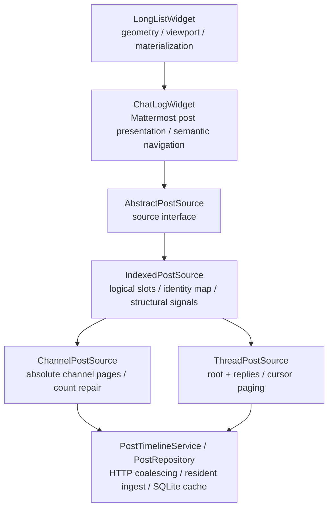
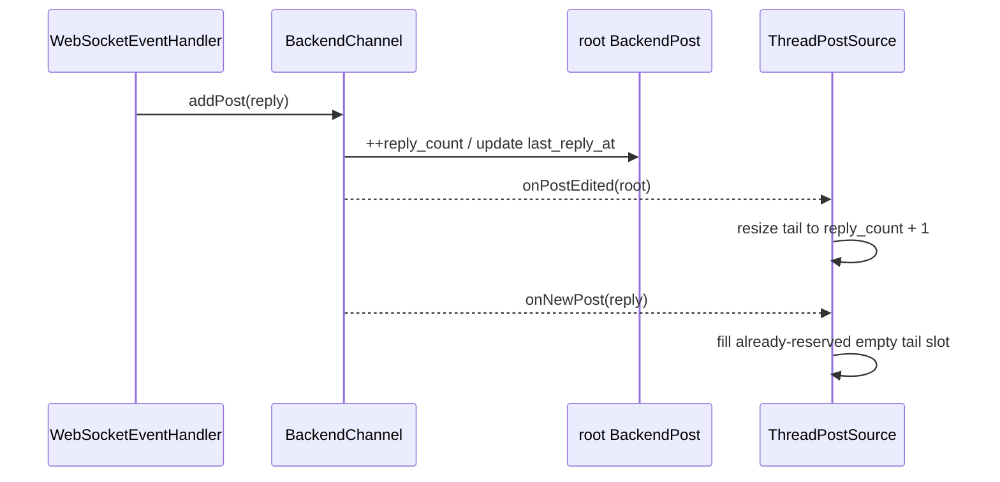

# Post source architecture

This document defines the ownership boundary shared by channel and thread timelines. It complements
`long-list-architecture.md` (viewport/geometry ownership) and `post-cache.md` (resident/durable post
storage). The central rule is that a source owns **logical post identity**, never pixels or transport
implementation details.

## Layering



`ChatLogWidget` intentionally does not own `postIds`, page arithmetic or thread cursor state. Both
concrete sources expose the same logical contract through `AbstractPostSource`; common identity
bookkeeping lives in `IndexedPostSource`.

## `AbstractPostSource`: interface only

`AbstractPostSource` is deliberately small. It defines what the view can ask of a logical sequence:

```cpp
itemCount();
isAvailable(index);
postAt(index);
indexOfPost(postId);
ensurePostIndex(postId);
requestRange(first, last, reason, generation);
```

and the structural/data signals consumed by `ChatLogWidget`:

```text
itemCountChanged(count)
itemsInserted(first, count)
itemsRemoved(first, count)
rangeAvailable(first, last)
itemsChanged(first, last)
rangeRequestFinished(first, last)
```

It contains no Mattermost paging policy and no storage container. This keeps alternate future post
sources possible without inheriting channel/thread assumptions.

## `IndexedPostSource`: shared logical identity space

Both current Mattermost sources maintain the same fundamental structures:

```cpp
QVector<QString> postIds;      // logical index -> post id; empty means unavailable
QHash<QString, int> postIndexes; // post id -> current logical index
BackendChannel& channel;       // resident identity -> BackendPost resolution
```

`IndexedPostSource` owns these structures and implements:

- `itemCount()`;
- `isAvailable()`;
- `postAt()`;
- `indexOfPost()`;
- rebuilding the reverse identity map;
- exact-window identity assignment;
- duplicate relocation when an authoritative window moves a previously provisional identity;
- no-op suppression when an already-known window is fetched again;
- tail resize;
- insertion of empty logical slots;
- structural slot removal.

It still does **not** know why a window is exact, which side of a sequence is authoritative, or which
network request produced it.

### Exact-window mutation

Concrete sources first establish positional authority, then hand the identity mutation to the base:

```text
source proves: IDs A B C belong at logical [17..19]
        |
        v
assignExactWindow(17, [A,B,C])
        |
        +-- clear old occurrences of A/B/C elsewhere
        +-- write A/B/C into [17..19]
        +-- rebuild postIndexes
        +-- report concrete identities that were replaced/cleared
        |
        v
publishExactWindow(...)
        |
        +-- itemsChanged only for previously concrete rows that changed
        +-- rangeAvailable for newly authoritative/available window
```

Fetching an identical page twice produces no source signals. This matters because `rangeAvailable`
and `itemsChanged` both schedule list synchronization; emitting them for an identity no-op can turn a
boundary mismatch into a tight repeat-request loop.

An empty string remains an **unavailable logical slot**, not a fake post and not a widget placeholder.
Only `LongListWidget` owns its estimated pixel height.

### Structural mutation

There are three generic structural primitives:

```text
resizeLogicalTail(newCount)
    changes only the newest/tail side and emits itemCountChanged

insertEmptyLogicalSlots(first, count)
    shifts existing logical identities right and emits itemsInserted

eraseLogicalSlots(first, count)
    removes logical identities, shifts later identities left and emits itemsRemoved
```

The base does not choose which primitive a count correction requires. That is topology-specific.

## Channel source

`ChannelPostSource` maps ordinary channel roots onto oldest-to-newest logical indices. Mattermost
`/channels/{id}/posts` pages are newest-anchored absolute pages, with the interactive invariant
`per_page=10`.

Transport-specific responsibilities that stay in `ChannelPostSource`:

- converting logical ranges to absolute Mattermost pages;
- loading one or two physical pages when an oldest-aligned logical block crosses a newest-aligned
  physical boundary;
- interpreting `total_msg_count_root` only as an initial estimate;
- symmetric oldest-boundary repair when that estimate is too large or too small;
- one-root distant boundary probes, exponential search and bounded binary search;
- preserving newest-page mapping while count growth/shrink changes the oldest prefix;
- provisional semantic navigation windows and adoption when an absolute page later intersects them;
- unknown-count compatibility mode when `total_msg_count_root` is absent.

### Channel count topology

A channel count correction preserves the **newest edge**:

```text
estimate too small                     estimate too large

[ newest known rows ]                   [ phantom ][ real rows ]
        ^                                         |
        | add empty prefix                         | remove prefix
        |                                         v
[ ? ? ? | newest known rows ]            [ real rows ]
```

This is why channel count repair uses prefix insertion/removal rather than the generic tail resize.
The proof of the corrected count remains channel-specific: only an absolute `/posts` short/empty/full
boundary has that authority.

## Thread source

`ThreadPostSource` maps one root plus replies:

```text
index 0             root
indices 1..N        replies oldest -> newest
```

Mattermost threads do not share the channel absolute-page grid. They are loaded through root/thread
requests and `(fromCreateAt, fromPost, direction)` cursors.

Transport/topology responsibilities that stay in `ThreadPostSource`:

- root permanently occupying logical index 0;
- `reply_count + 1` as the initial logical size estimate;
- initial oldest window and newest tail placement;
- exact placement immediately before/after a known cursor identity;
- timestamp approximation only for a disconnected middle seek;
- root/reply filtering;
- live reply ordering and count interaction;
- any future thread count reconciliation based on thread-specific boundary evidence.

### Live reply transaction

A posted reply currently enters the resident model in this order:



The reply must be counted exactly once. `onPostEdited(root)` normally reserves the new logical tail
slot first; `appendLiveReply()` fills that slot instead of appending another one. A defensive fallback
may grow the tail only if a producer delivers the reply before the root metadata update.

This ordering is thread-specific. The generic base only supplies safe tail resize and exact single-slot
identity assignment.

## What is intentionally *not* shared

The following concepts must not move into `IndexedPostSource`, `ChatLogWidget` or `LongListWidget`:

| Concept | Owner |
| --- | --- |
| `/posts?page=N&per_page=10` mapping | `ChannelPostSource` |
| `total_msg_count_root` adjustment | `ChannelPostSource` |
| oldest exponential/binary page probing | `ChannelPostSource` |
| provisional channel navigation island | `ChannelPostSource` |
| thread root at index 0 | `ThreadPostSource` |
| thread `fromPost/fromCreateAt` cursors | `ThreadPostSource` / repository transport |
| thread initial/tail authority | `ThreadPostSource` |
| scrollbar, pixels, viewport anchor | `LongListWidget` |
| semantic post-ID navigation lock | `ChatLogWidget` + `LongListWidget` lock |
| HTTP/SQLite/WebSocket snapshot freshness | `PostRepository` / `PostCacheService` |

Sharing these would make the common base depend on one Mattermost endpoint and would eventually force
the other source to emulate semantics it does not have.

## Cache interaction

Sources store IDs, not durable `BackendPost*` pointers. `postAt()` resolves an available ID through the
current `BackendChannel` resident map each time. This is required for the planned bounded resident
cache: a post body may eventually be evicted and later rematerialized from SQLite/HTTP without changing
its logical identity.

Cached post data has weaker authority than server transport placement:

- a direct cache hit may make an identity resident;
- a cached newest channel/thread suffix may be used for provisional first paint;
- SQLite timestamps/ordering do not prove an absolute channel page or thread cursor adjacency;
- HTTP/thread boundary results are still required before a provisional window becomes authoritative.

See `post-cache.md` for snapshot freshness and resident/durable ownership.

## Extension rules

When adding a new source behavior, decide in this order:

1. **Does it manipulate pixels, scrollbar or materialized widgets?** It belongs in `LongListWidget`.
2. **Does it present or navigate by semantic post ID?** It belongs in `ChatLogWidget`.
3. **Is it pure logical ID/slot bookkeeping independent of Mattermost transport?** It belongs in
   `IndexedPostSource`.
4. **Does it prove where a result belongs using channel pages or thread cursors?** It stays in the
   concrete source.
5. **Does it retrieve/cache/fence post snapshots?** It belongs below the sources in
   `PostRepository`/`PostCacheService`.

The goal is not maximum inheritance. The goal is one owner for each invariant.
