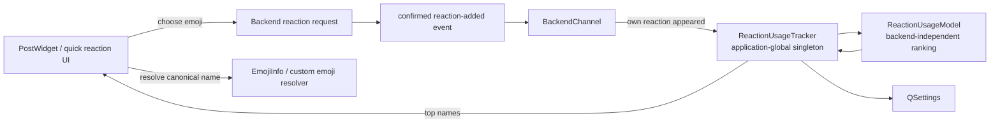

# Reaction quick bar and popularity ranking

Mattermost-Qt keeps a small application-wide reaction history to make frequently and recently used reactions available directly from the message hover UI.

The ranking is deliberately independent of a Mattermost `Backend`. A reaction is persisted by its canonical emoji name, such as `fire` or `rolling_on_the_floor_laughing`; the active emoji registry is responsible for resolving that name to Unicode or a custom-emoji image when the UI is built.

## Goals

The quick-reaction design has several competing requirements:

- a reaction just used by the user should become immediately available;
- reactions used repeatedly should remain useful longer than one-off reactions;
- old habits must not dominate forever;
- counters must remain bounded even after years of use;
- a newly introduced standard or custom emoji must be able to enter the ranking;
- ranking state must be global to the application rather than duplicated per server session;
- unavailable custom emoji must not prevent the rest of the quick bar from rendering.

The implementation separates **recency** (`heat`) from **familiarity** (`count`) rather than sorting by a lifetime usage counter.

## Architecture



`ReactionUsageModel` contains no `Backend`, network, channel or server identity. It only knows reaction names and ranking values.

`ReactionUsageTracker` is an application-global singleton. It owns the ten-entry model and persists it in `QSettings`.

`BackendChannel` is only an integration point: when a reaction-added update actually changes a post from "our reaction is absent" to "our reaction is present", it records that canonical emoji name in the global tracker. The ranking algorithm itself does not live in the backend.

The quick-bar controller reads ranked names and resolves them through the current emoji registry. Standard emoji resolve locally. A missing custom name can trigger the existing asynchronous custom-emoji lookup; until it is renderable it is simply omitted from that quick bar instance.

## What counts as a use

A click is not sufficient to increase popularity.

Mattermost toggles reactions, and the same reaction event may also be observed more than once during synchronization. Therefore usage is recorded only when the post model observes a successful transition for the logged-in user:

```text
our reaction absent -> reaction-added update -> our reaction present
```

The following do **not** increase the usage score:

- clicking a reaction that removes an already-present reaction;
- another user's reaction;
- a duplicate reaction-added update that leaves our reaction already present;
- a failed request that never results in the reaction appearing in the post model.

This keeps the popularity model tied to successful user actions rather than UI attempts.

## Ranking state

Each retained reaction has:

```text
name   canonical Mattermost emoji name
count  bounded effective familiarity score
heat   current recency score in (0, 1]
```

Only the ten hottest entries are retained. `count` is **not** a lifetime telemetry counter. It is deliberately an aging score used only to determine how slowly `heat` should decay.

Ranking order is:

1. higher `heat`;
2. higher `count` when heat is equal;
3. emoji name as a deterministic final tie-break.

## Cooling formula

On every successful reaction use, all existing entries cool first.

For an entry with effective count `c` and current heat `h`:

```text
h' = h * exp(-0.5 / sqrt(c))
```

The selected reaction is then updated:

```text
count = count + 1
heat  = 1.0
```

A newly seen reaction starts as:

```text
count = 1
heat  = 1.0
```

Because the selected reaction is reheated to `1.0`, the most recently used reaction always reaches the top immediately. Familiarity affects how long it remains competitive afterwards, not whether it can reach the top.

### Heat half-life

The number of subsequent reaction events required to halve an untouched entry's heat is approximately:

```text
T_half = ln(2) / 0.5 * sqrt(c)
       ~= 1.386 * sqrt(c)
```

Examples before count aging:

| Effective count | Approximate heat half-life |
| ---: | ---: |
| 1 | 1.4 reaction events |
| 9 | 4.2 reaction events |
| 64 | 11.1 reaction events |
| 127 | 15.6 reaction events |

A one-off reaction therefore disappears from prominence quickly, while a familiar reaction survives a moderate amount of unrelated activity.

## Aging the familiarity count

A monotonically increasing lifetime counter would eventually make old favorites almost immune to cooling. It would also grow forever and make later emoji disproportionately hard to establish.

To avoid this, `count` is periodically renormalized.

The current threshold is:

```text
CountAgingThreshold = 128
```

Whenever any retained entry reaches or exceeds the threshold, **all** retained counts are aged together:

```text
count = ceil(count / 2)
```

If persisted legacy/corrupt data contains a value still above the threshold after one pass, aging repeats until every count is below 128.

`heat` is intentionally left unchanged during this operation.

Example:

```text
before aging:
    fire   count=128  heat=1.00
    eyes   count= 51  heat=0.74
    clap   count=  3  heat=0.32

after aging:
    fire   count= 64  heat=1.00
    eyes   count= 26  heat=0.74
    clap   count=  2  heat=0.32
```

This has three useful properties:

1. the current ranking does not jump merely because normalization occurred;
2. historical familiarity is preserved approximately relative to other entries;
3. no reaction can acquire an arbitrarily long cooling half-life.

With the threshold at 128, the largest normal stored count is 127, which bounds the heat half-life at roughly 15.6 subsequent reaction events. Repeated long-term use can keep a reaction familiar, but old history cannot make it permanently dominant.

This also gives newly introduced emoji a practical route into the ranking: their first successful use still produces `heat=1`, and old entries have a bounded decay rate. Repeated use of the new emoji then builds its own effective familiarity normally.

## Persistence

The tracker stores the ranking under:

```text
reaction_usage/popularity_v1
```

in `QSettings`.

The payload is a compact JSON array containing only:

```json
[
  {"name":"fire","count":"23","heat":0.82},
  {"name":"eyes","count":"7","heat":0.61}
]
```

`count` is serialized as a decimal string to avoid JSON-number precision loss for old or malformed large values.

On restore the model:

- discards empty names, zero counts and invalid/non-positive heat;
- clamps heat to at most `1.0`;
- merges duplicate names conservatively using the higher count and heat;
- runs count aging until every restored count is below the threshold;
- keeps only the ten hottest entries.

Thus an older settings file containing an enormous count cannot reintroduce permanent ranking inertia.

## Quick-bar composition

Hovering the reaction affordance opens a compact strip with at most six reaction actions.

Candidate construction is:

```text
1. take up to 3 hottest renderable reactions from the popularity ranking
2. add up to 3 non-overlapping favorite/default reactions
3. if overlaps left empty slots, continue taking lower-ranked popular reactions
4. never display the same emoji twice
5. omit names that the active emoji registry cannot currently render
```

The default favorite set is:

```text
:+1:
:eyes:
:fire:
:rolling_on_the_floor_laughing:
```

The old untouched default favorites list is migrated to this smaller set. Existing user-customized favorites are preserved by the migration code.

Clicking the heart itself remains the path to the complete emoji chooser; the hover strip is only a shortcut for common reactions.

Example with popularity:

```text
eyes, fire, rolling_on_the_floor_laughing, +1, clap, rocket
```

and the default favorites above produces:

```text
eyes | fire | rolling_on_the_floor_laughing | +1 | clap | rocket
```

The favorite overlap does not waste slots; `clap` and `rocket` are pulled from the remaining popularity ranking.

## Custom emoji and multiple backends

Popularity intentionally stores only the canonical emoji **name**. It does not persist a server URL, backend pointer, downloaded image path or custom-emoji ID.

Consequences:

- the same standard emoji history is naturally shared across all logged-in servers;
- a custom emoji can participate in global ranking without coupling the tracker to one backend;
- if that custom name is unavailable on the active server, the UI filters it out;
- resolving/downloading custom emoji remains the responsibility of the existing emoji service and registry.

The ranking layer must stay backend-independent even if custom-emoji resolution changes in the future.

## Implementation files

The main pieces are:

```text
sources/reactions/ReactionUsage.h
    pure ranking, cooling, count aging, serialization helpers,
    quick-strip selection policy

sources/reactions/ReactionUsageTracker.{h,cpp}
    process-wide singleton and QSettings persistence

sources/backend/types/BackendChannel.cpp
    confirmed-own-reaction integration point

sources/chat-area/post/reactions/ReactionQuickBarController.cpp
    hover popup, renderability filtering and emoji presentation

tests/EmojiDialogSupportTest.cpp
    ranking, aging, persistence and quick-strip policy tests
```

## Invariants for future changes

Changes to reaction ranking should preserve these invariants:

- the ranking model must not own or require a `Backend`;
- only a successful newly-added reaction from the logged-in user counts as usage;
- the most recently used reaction must be able to reach the top immediately;
- familiarity may slow cooling but must remain bounded/aging;
- count aging must not directly change heat;
- restored persisted state must obey the same bounds as newly generated state;
- the retained popularity set must stay bounded;
- unresolvable custom emoji must not break or block standard quick reactions;
- quick-bar composition must deduplicate favorite/popular overlap.
