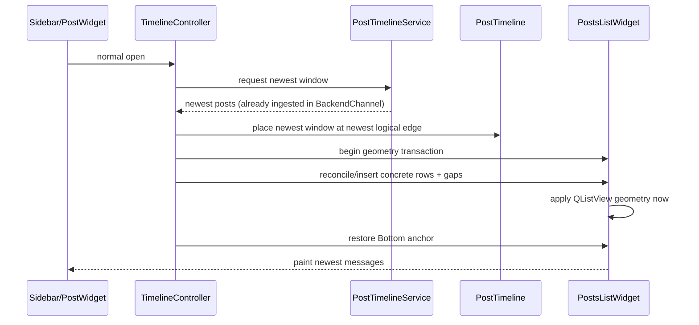

# Sparse timeline architecture

This document is the implementation contract for Mattermost-Qt channel and thread timelines.
It intentionally describes **who owns each state transition**, which operations may perform
network I/O, and which operations are allowed to mutate the visible viewport. Timeline changes
should update this document together with code when an invariant changes.

## Goals and invariants

1. Channels and threads use the same sparse-timeline semantics. They may use different server
   endpoints, but scrollbar/seek/prune/render policy must not diverge.
2. A normal channel/thread open means **newest**. Attention, Recent and permalink navigation are
   explicit semantic targets and override the default newest position.
3. A user gesture owns the viewport. Layout, image reflow, pruning, websocket events and stale
   HTTP responses may not move it.
4. Random scrollbar seek is logical, not pixel-derived:
   `fraction = (value-min)/(max-min)`, `target ~= fraction * (logicalCount-1)`.
   Refining estimated row heights must not change an active drag target.
5. One seek generation is a bounded transaction: debounce -> seed -> edges -> measure -> optional
   bounded refinement -> commit. A newer user target invalidates the old generation for UI
   mutation, but successful old responses are still ingested into the memory cache.
6. Materialized UI is bounded to roughly 200 posts per channel/thread. The visible logical range
   plus at least 10 posts on both sides is never a pruning candidate. Prefer evicting the farthest
   rows first.
7. UI mutations are incremental whenever identity is known. Existing `PostWidget` identity is
   retained; live posts are one-row mutations; pruning removes exact distant rows and grows gaps.
8. Any transaction that changes row/gap geometry must be atomic from Qt's point of view:
   block scrollbar-driven controller reactions, disable viewport painting, mutate rows/size hints,
   force QListView geometry/layout to the new state, restore the semantic anchor, then re-enable
   painting/signals. Never restore an anchor against stale pre-layout geometry.
9. `renderTimeline()`/reconciliation must never itself schedule an unbounded
   `render -> viewportCheck -> fetch -> render` feedback loop.
10. Network requests belong to `PostTimelineService`. Exact duplicate in-flight range requests
    are coalesced there. Controllers decide *what logical range is needed*, not HTTP dedup policy.
11. Backend/memory cache ingestion happens before UI-generation checks. Stale responses are useful
    cache data even when they are no longer allowed to move the current viewport.
12. Persistent SQLite post/timeline cache is a separate follow-up layer. It must sit below the same
    `PostTimelineService`/memory model contract rather than becoming a second navigation system.

## Components and source map

| Responsibility | Implementation |
| --- | --- |
| Sparse logical topology, loaded spans, gaps, measured heights, logical/pixel mapping | `sources/backend/PostTimeline.{h,cpp}` |
| Shared seek generation/state and edge choice | `sources/backend/TimelineSeekState.h` |
| Timeline HTTP access, ingestion and in-flight request coalescing | `sources/backend/PostTimelineService.{h,cpp}`, `PostTimelineThreadCursor.cpp` |
| Channel endpoint adapter and channel-specific metadata | `sources/chat-area/ChannelTimelineController*` |
| Thread endpoint adapter and thread-specific metadata | `sources/chat-area/ThreadTimelineController*` |
| Concrete rows, gap rows, saved semantic viewport anchor, Qt reconciliation transaction | `sources/chat-area/PostsListWidget*`, `ResizableListWidget*` |
| Exact/Attention/Recent navigation orchestration | `sources/navigation/AppNavigationService.*`, sidebar widgets |
| Live channel append | `sources/chat-area/ChannelTimelineLive.cpp` |
| Live thread append / newest-tail open | `sources/chat-area/ThreadTimelineLive.cpp` |
| Incremental pruning | `ChannelTimelinePruning.cpp`, `ThreadTimelinePruning.cpp` |

`ChannelTimelineController` and `ThreadTimelineController` are adapters around the same business
rules. If an algorithm can be expressed without channel/thread server details, it belongs in
`PostTimeline`, `TimelineSeekState`, `PostTimelineService`, or a shared timeline policy helper.

## Normal open



There must be no intermediate `scrollToBottom()` over an unmaterialized trailing gap.

## Explicit semantic navigation

Priority is:

`explicit permalink/post > Attention/Recent last_viewed_at target > ordinary newest open`.

For a followed thread, `ThreadResponse.last_viewed_at` is the canonical read boundary. Navigation
selects the first reply strictly newer than it. If no unread reply exists, the ordinary thread
policy is newest/bottom unless an exact fallback target was explicitly requested.

## Random thumb seek

```mermaid
sequenceDiagram
    participant U as User
    participant C as Controller
    participant Q as TimelineSeekState
    participant S as PostTimelineService
    participant M as PostTimeline
    participant L as PostsListWidget

    U->>C: drag thumb
    C->>Q: setTarget(normalized logical index)
    Note over C,Q: 100 ms debounce while thumb moves
    Q-->>C: generation N ready
    C->>S: seed 10 around target
    S-->>C: seed response
    alt generation N still current
        C->>M: place/merge seed inside target gap
        C->>L: atomic geometry transaction, preserve target/viewport
        C->>S: 10 older / 10 newer as needed
        S-->>C: edge response(s)
        C->>M: merge contiguous window
        C->>L: atomic geometry transaction
        C->>M: measure actual row heights
        C->>S: bounded extra edge request only if viewport + buffers are not covered
    else user moved to generation N+1
        Note over S,M: response is ingested/cache-only; no visible mutation
    end
    C->>Q: complete generation N
```

The first stage targets roughly 30 rows (`10 + 10 + 10`). Refinement is based on actual rendered
height and aims to cover the viewport plus about one viewport of buffer above and below. It is
bounded; it must never turn into an autonomous page-walking loop.

## Slow wheel / local prefetch

Wheel scrolling is not a random seek. The **current concrete viewport anchor** remains the user
intent. When the viewport approaches a gap, load a small adjacent page/window and merge it while
preserving that anchor. Do not re-center a server result as if the user had dragged the thumb.

A delayed/stale wheel response may populate memory/sparse topology, but it may not move a viewport
that has since received newer user input.

## Geometry transaction

All operations below use the same transaction:

- initial/newest materialization;
- random-seek seed/edge merge;
- adjacent gap fill;
- permalink/context merge;
- gap-height recalibration;
- incremental pruning.

```text
block controller reactions + painting
        -> mutate rows/gaps/sizeHints
        -> force QListView layout / scrollbar range update
        -> restore semantic Post/Gap/Bottom anchor against NEW geometry
        -> unblock and paint once
```

Restoring before QListView has applied the new geometry is invalid: Qt may later change the range
and leave the viewport inside a gap even though the restore was mathematically correct for the old
layout.

## Live append

A websocket post/reply is exactly one logical-slot mutation when its identity is new.

```text
websocket -> BackendChannel ingest -> PostTimeline tail slot -> one PostWidget insertion
```

No full `renderTimeline()`, `adjustSize()`, unconditional `scrollToBottom()`, or network request is
allowed on this path. Sticky-bottom behavior is owned by `PostsListWidget`'s explicit saved anchor.

## Pruning

Pruning is a memory operation, never navigation.

1. Do not prune during an active seek, active thumb drag, semantic navigation lock, or an in-flight
   timeline mutation.
2. Determine the real visible post range from concrete `PostWidget` rows.
3. Protect `[firstVisible - 10, lastVisible + 10]` logical rows.
4. Keep additional loaded rows by distance from the viewport until the ~200-row budget is met.
5. Remove only selected distant concrete rows, grow/merge corresponding gaps, force geometry,
   restore the same viewport anchor, paint once.

Future persistent cache eviction is a separate layer: pruning a `PostWidget` does not imply deleting
its BackendPost/disk payload.

## Networking and future persistent cache

`PostTimelineService` is the single range-request coordinator. Before issuing HTTP it should be able
to answer, in order:

1. Is the exact required logical/cursor range already materialized?
2. Is it present in the BackendChannel/memory cache?
3. Is an equivalent request already in flight? If so, join it.
4. (Future PR) Is it present in the SQLite application cache?
5. Request only the missing server range, using normal page-sized blocks rather than one-row HTTP
   requests.

The planned SQLite cache stores Mattermost post payloads plus indexed fields needed for lookup
(`post_id`, `channel_id`, `root_id`, timestamps, access metadata, and any additional fields justified
by actual query patterns). Cache schema/indexes should be designed from concrete lookup paths, not
from the current `BackendPost` field list.

## Tests that should guard the contract

- normalized scrollbar fraction -> stable logical target;
- newer seek generation invalidates older UI response;
- staged window growth is bounded and balances edges;
- loaded windows merge without relocating retained IDs;
- live append preserves all previous logical indices;
- pruning never removes visible ±10 protected rows;
- newest-tail placement ends on a concrete newest post, not a gap;
- geometry transaction tests should verify that anchor restoration is performed after the new Qt
  layout/range is committed (widget-level offscreen test where practical).
